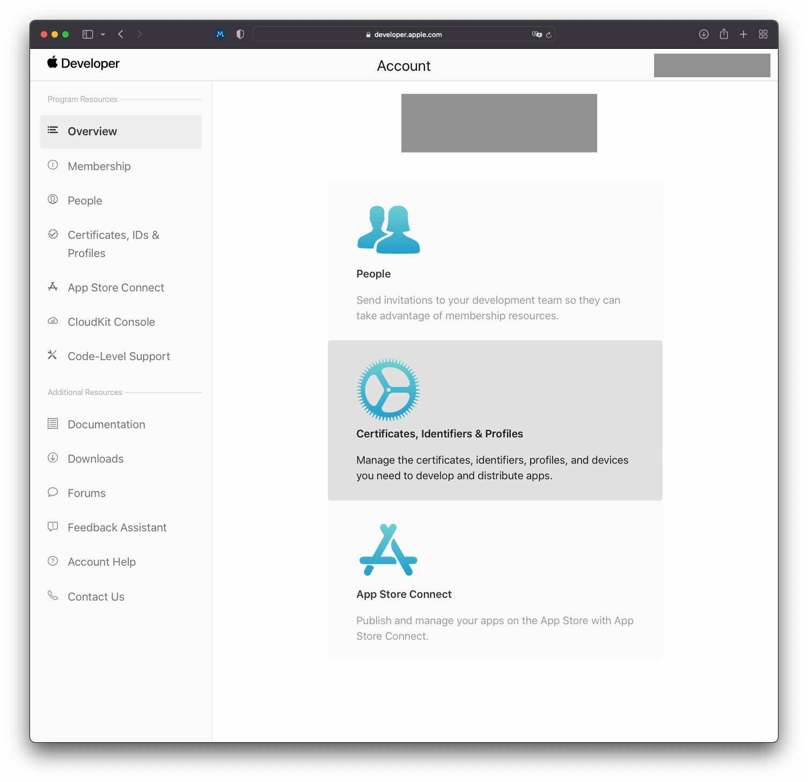
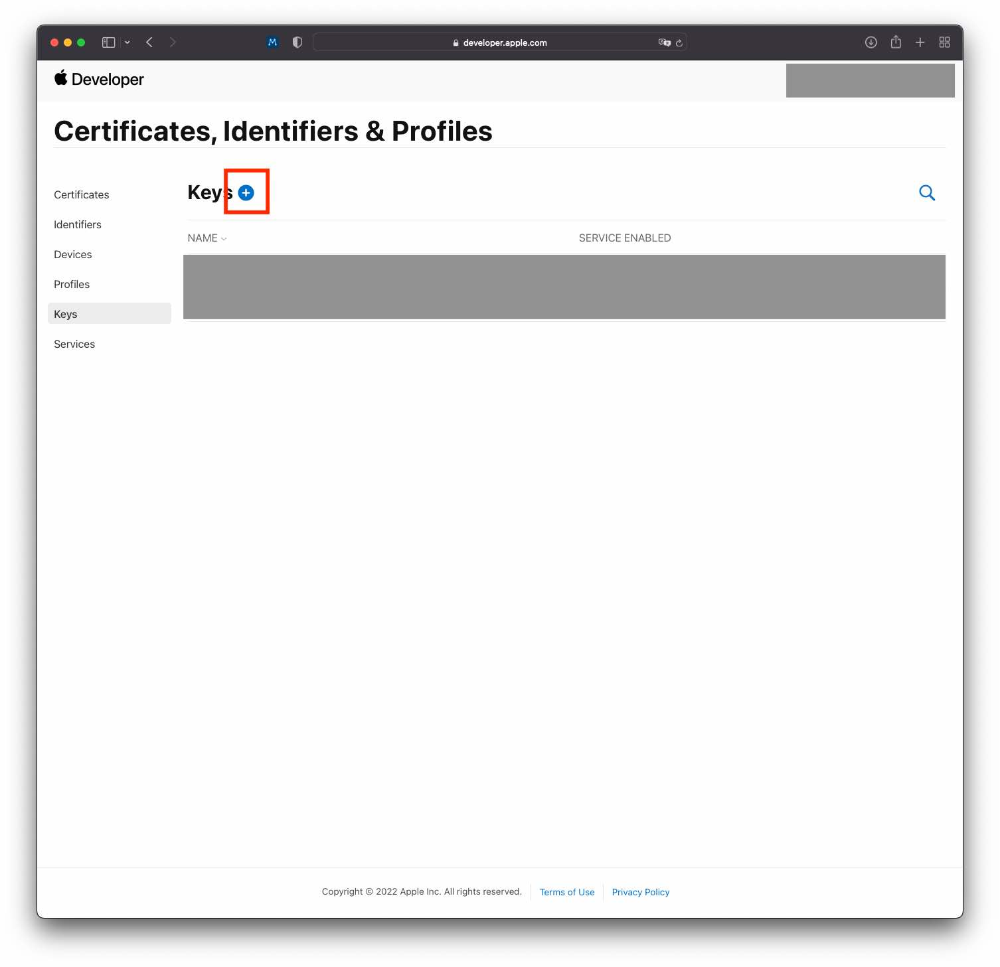
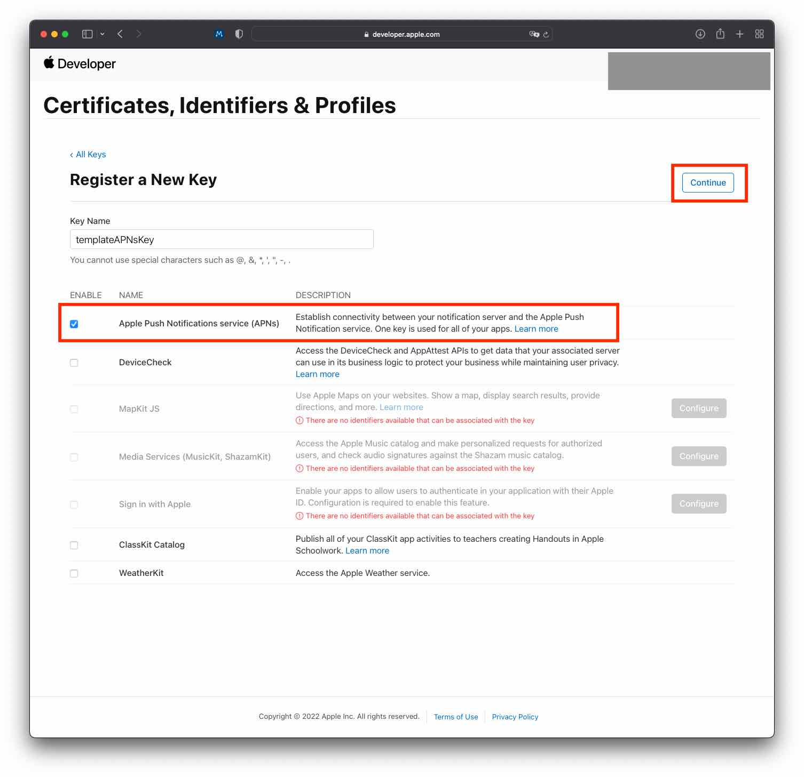
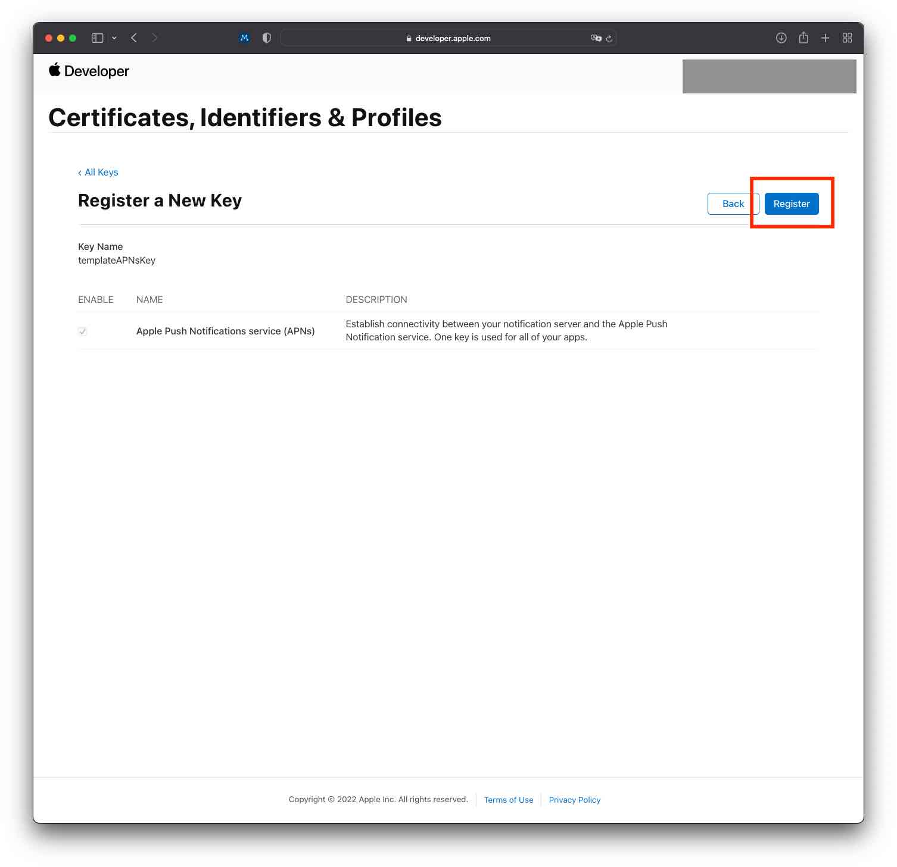
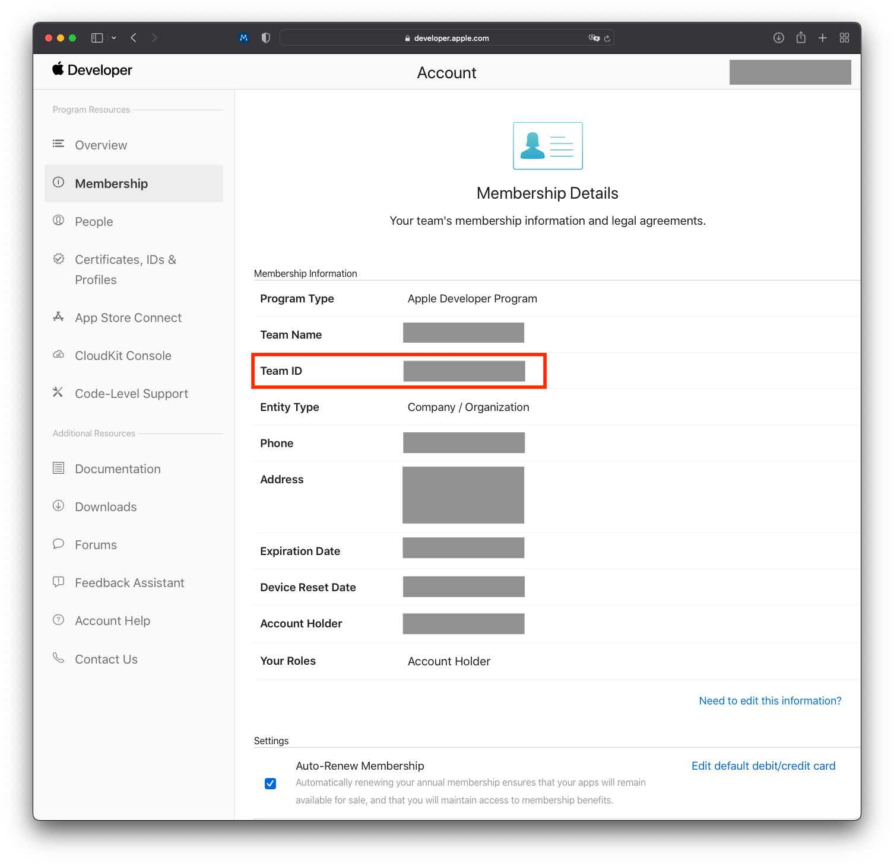
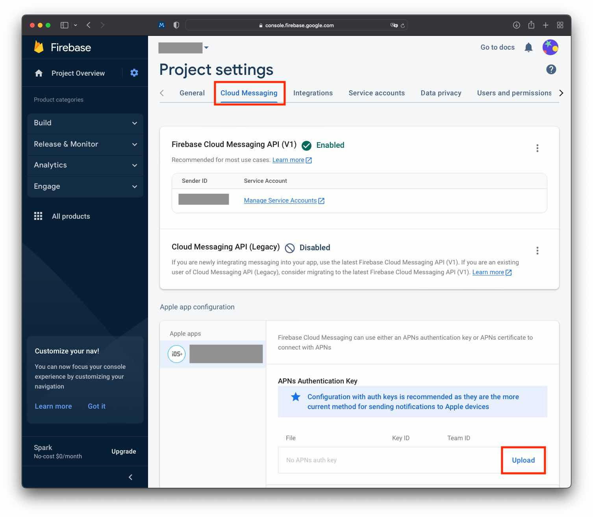

# How to configure the push notification service in Vocechat?

The administrator needs to configure **FCM** in Firebase Cloud Console.

⚠️ Please be noted that Push Notifiation will **NOT** be available on mobile devices (iOS and Android) if a customized configuration is applied. It will only work on web client. A default Firebase config is applied in latest web client. You may check it out in Settings -> Firebase. 

⚠️ If the VoceChat backend is deployed in Mainland China, Push Notification may not be available because of Internet regulation, as the Push Notification service is based on Google Firebase. We are working on an alternative directly supporting APNs and other Android services in Mainland China.

<!-- ## 1. Obtain APNs Auth Key

1. Go to [Apple Developer Member Center](https://developer.apple.com/account/), and hit [Certificates, Identifiers & Profiles](https://developer.apple.com/account/resources/certificates/list).

   

2. Hit _Keys_ from the left menu, then click "Plus" icon to add a key.
   

3. Fill key Name, select **Apple Push Notifications service (APNs)**, then hit **Continue**
   

4. Click **Register**
   

5. In the following page, download your keys (should be a .p8 file), note down your key ID, and save them properly.
   

6. In [Membership Page](https://developer.apple.com/account/#!/membership/), note down your **Team ID**.
    -->

## Firebase settings

The administrator needs to first create the firebase project and has added the corresponding service code to the project.
If you have completed the above steps, you can skip this paragraph;
If not, see [FCM](https://firebase.google.com/docs/cloud-messaging).

1.  Get the configuration file from the `Firebase` console
    Access [Firebase Console](https://console.firebase.google.com),
    Click the gear icon on the left sidebar to enter **Project Settings**
    

2.  Then, in the horizontal tab at the top of the page, select **Service Accounts**.
    Drop down the page to the bottom, click **generate new private key**, and save the downloaded JSON file properly.
    

3.  Copy relevant configuration items to voce chat settings
    Enter **VoceChat Settings** page, select **Firebase** in **Configuration**. Four configuration items can be filled in this page, namely token URL, project ID, private key and client email.
    You can download in step 1 above, find the corresponding field in the JSON file, copy and paste it, and then save it.
    

<!-- 4.  Go to **Cloud Messaging** Tab
    In the lower part of the page, inside **Apple app configuration**, click **Upload**. Select the .p8 file saved in **Step 1.5**, fill **Key ID** and **Team ID** (which can be found in APNs settings above), and hit **Upload**
     -->
