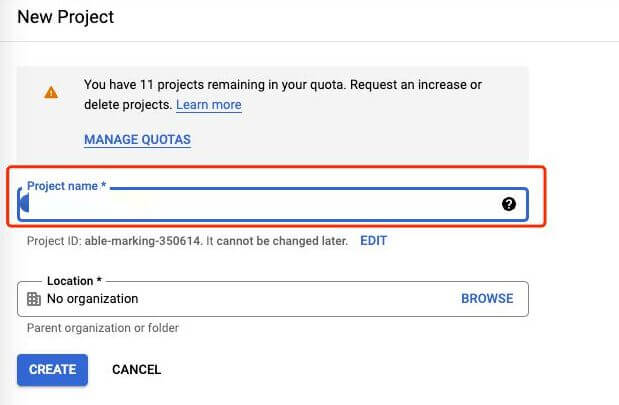
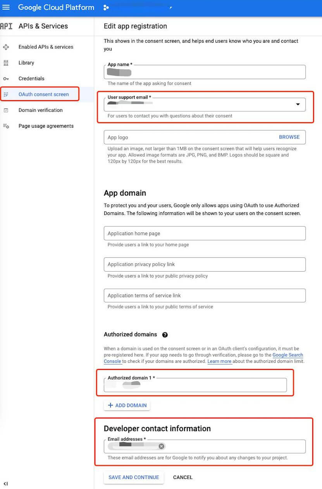
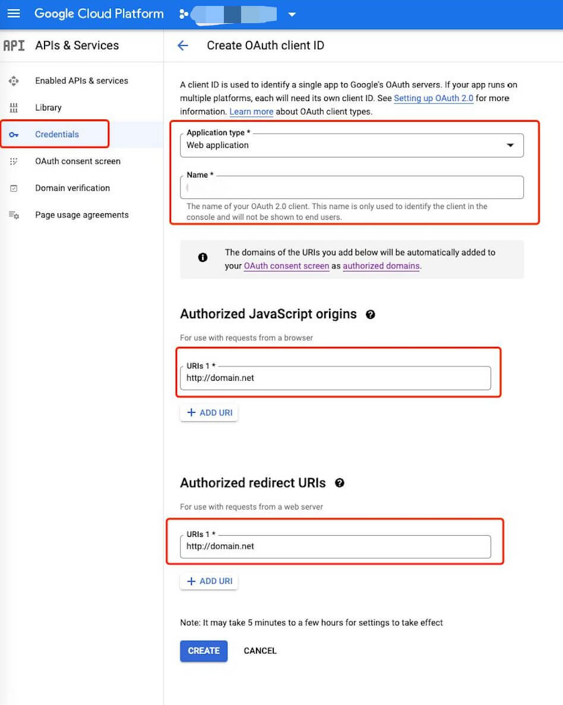

# How to set up Google Login?

After Google login is enabled, you may let new members sign in as follows:

Steps:

### 1. You need to use your top-level domain name

Google login application needs top-level domain names, and secondary domain names cannot be used for a separate application.

### 2. Open the Google console and create a new project

https://console.developers.google.com/apis  

### 3. Create a `consent screen`

For **Authorized domains**, if your **vocechat** is deployed on your domain, please fill it with your top-level domain. This top-level domain will be seen on consent screen of **Sign in with Google**.

For example: if your **vocechat** can be accessed via `https://chat.domain.com/`, fill it with `domain.com`.

If you are using `localhost` as your host server, please fill it with both `http://localhost` and `http://localhost:3000`.

### 4. Create `credentials`

For **Authorized JavaScript origins**, type in the url that the front-end is deployed on.

For example: If you can see login page by visiting `https://chat.domain.com/`,type it in the **Authorized JavaScript origins**.

Leave **Authorized redict URIs** blank.

  
After this step, you will get the ClientID and PrivateKey.

### 5. Paste ClientID to Vocechat settings.

Paste the ClientID here.  

