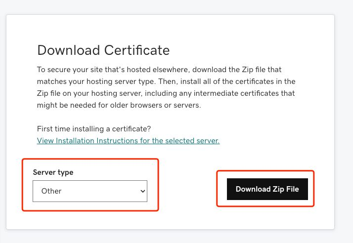

# 如何在 Godaddy 获取和使用证书？

在开始以前需要普及一下证书相关的知识。

- .key: PKCS8 格式的私钥文件（Base64 编码）
- .csr: PKCS10 格式的证书部分信息（包含公钥和域名、组织名等信息。公钥由 .key 来生成）
- .crt: 证书文件，在 .csr 基础上加上了 CA 签名信息（Godaddy 会根据用户上传的 .csr 文件生成它）
- .der: 二进制格式，跟 pem 可以互相转换，转换命令：`openssl x509 -inform der -in xxx.der -out xxx.pem`
- .pem: base64 格式编码的文件，根据头尾字符标识来判断具体的内容，可能是私钥，公钥，证书任意数据。
- .p12, .pkcs12, .pfx: PKCS12 格式的合并文件，里面包含私钥，公钥，证书等信息。

### 1. 在本机生成私钥 & CSR & 证书文件:

```shell
# 生成私钥文件
openssl genpkey -algorithm RSA \
    -pkeyopt rsa_keygen_bits:4096 \
    -pkeyopt rsa_keygen_pubexp:65537 | \
    openssl pkcs8 -topk8 -nocrypt -outform pem > vocechat.com.key

# 生成 CSR 文件
openssl req -subj "/C=US/ST=Arizona/L=Scottsdale/O=vocechat,Inc./CN=vocechat.com/emailAddress=api.privoce@gmail.com" \
    -new -days 3650 -key vocechat.com.key -out vocechat.com.csr

# 生成自签名文件
openssl x509 -signkey vocechat.com.key -in vocechat.com.csr -req -days 365 -out vocechat.com.crt

# 查看证书
openssl req -text -noout -verify -in vocechat.com.csr
```

将获得以下文件，很重要，注意备份好：

```shell
-rw-r--r--  1 user  staff   1.9K May  5 00:34 vocechat.com.crt
-rw-r--r--  1 user  staff   1.7K May  5 00:34 vocechat.com.csr
-rw-r--r--  1 user  staff   3.2K May  5 00:29 vocechat.com.key
```

通过 .key, .crt 我们已经已经可以配置 nginx 类似的系统了，只是浏览器会提示风险。

### 2. 申请 Godaddy 账号，购买域名证书，需要走支付流程，根据提示即可。

Godaddy 官网：https://www.godaddy.com/

### 3. 设置域名 & CSR：


### 4. 下载证书

  
将会得到一个压缩文件 xxx.zip，解压后得到以下下文件：

```shell
-rw-rw-r--@ 1 user  staff   2.4K May  4 07:47 1aeb156731cb52d3.crt
-rw-rw-r--@ 1 user  staff   2.4K May  4 07:47 1aeb156731cb52d3.pem
-rw-rw-r--@ 1 user  staff   4.7K May  4 07:47 gd_bundle-g2-g1.crt
```

### 5. 合并证书，覆盖掉前面我们的自签名证书（我们有了更好的证书）。

```shell
cat 1aeb156731cb52d3.crt gd_bundle-g2-g1.crt > vocechat.com.crt
```

### 6。 vocechat-server 配置

拷贝证书文件：

```
cp vocechat.com.crt cert/ca.crt
cp vocechat.com.key cert/ca.key
```

修改 config/config.toml

```shell

[network]
bind = "0.0.0.0:3000"
domain = "domain.com"

# [network.tls]
# type = "self_signed"

[network.tls]
type = "certificate"
# cert = "/path/vocechat.com.crt"
# key = "...."
path = "./cert"
```

重启 vocechat-server:

```shell
/etc/init.d/vocechat-server restart
```

<!--
```shell
server {
    listen 443;
    server_name www.xxx.com;
    ssl	on;
    ssl_certificate /usr/local/ssl/domain.crt;
    ssl_certificate_key /usr/local/ssl/domain.key;
}
```
-->
