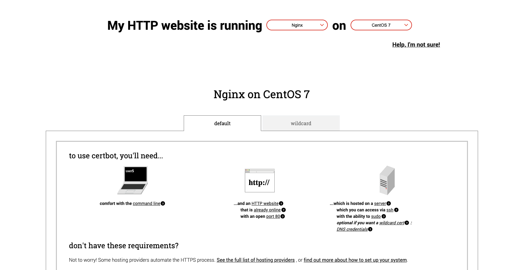

> 如果你自己服务器已安装 Nginx 和 Docker，推荐使用该方式部署 vocechat。下面举例的服务器操作系统为 `CentOS 7.9`，域名为`vocechat.yourdomain.com`

## 概述

基本流程：Nginx 代理了 Vocechat 的请求，并将请求转发给 vocechat-server:3000

```
┌─────────┐                  ┌─────────┐        ┌─────────┐
│         │                  │  Nginx  │        │         │
│ Client  ├─────────────────►│    CA   ├──────► │ vocechat│
│         │                  │   443   │        │   3000  │
└─────────┘                  └─────────┘        └─────────┘
```

## 使用 Docker 运行 Vocechat

```shell
docker run -d --restart=always \
  -p 3009:3000 \
  --name vocechat-server \
  -v ~/.vocechat-server/data:/home/vocechat-server/data \
  privoce/vocechat-server:latest

```

## 配置 Nginx http 反向代理

在 Nginx 配置文件目录（一般在`/etc/nginx/conf.d`）新建 Nginx 配置文件`vocechat.yourdomain.com.conf`，并配置好 http 请求：

```nginx
server{
  server_name vocechat.yourdomain.com;
  location / {
        proxy_pass http://127.0.0.1:3009; # 此处端口号取决于docker运行的对外端口号
        proxy_redirect off;
        proxy_set_header        Host    $host;
        proxy_set_header        X-Real-IP       $remote_addr;
        proxy_set_header        X-Forwarded-For $proxy_add_x_forwarded_for;
        proxy_next_upstream error timeout invalid_header http_500 http_502 http_503 http_504;
        proxy_max_temp_file_size 0; # 关掉硬盘缓存，增加写速度
        # SSE 相关配置
        proxy_http_version 1.1;
        proxy_set_header Connection '';
    }
}
```

检查配置文件的语法：`nginx -t`，没问题后，启用新增配置：`nginx -s reload`。此时，浏览器访问`http://vocechat.yourdomain.com`，应该能够进入初始化页面。

> 注意：不要忘记设置域名解析

## 配置 https

基本原理：让 Nginx 监听 443 端口，证书配置在 Nginx，通过 host 转发给 vocechat-server:3000，此时 vocechat-server 是普通的 HTTP.

https 域名证书有多种方式获得，此处我们推荐使用[certbot](https://certbot.eff.org/instructions)，借助 certbot 可以自动生成证书并自动修改 Nginx 配置文件，完成 https 的启用。

### Certbot 的使用

访问 https://certbot.eff.org/instructions ，请自行选择服务器环境，完成安装:



使用以下命令，certbot 会列出已有的 Nginx 配置，选择对应的域名，获取证书，并让 certbot 自动编辑该 Nginx 配置文件，一键开启 https 访问：

```shell
# 如果非root用户，把sudo加上
sudo certbot certonly --nginx
```

此时，配置文件`vocechat.yourdomain.com.conf`已变为：

```nginx

server{
    server_name vocechat.yourdomain.com;
    location / {
        proxy_pass http://127.0.0.1:3009; # 此处端口号取决于docker运行的对外端口号
        proxy_redirect off;
        proxy_set_header        Host    $host;
        proxy_set_header        X-Real-IP       $remote_addr;
        proxy_set_header        X-Forwarded-For $proxy_add_x_forwarded_for;
        proxy_next_upstream error timeout invalid_header http_500 http_502 http_503 http_504;
        proxy_max_temp_file_size 0; # 关掉硬盘缓存，增加写速度
        # SSE 相关配置
        proxy_http_version 1.1;
        proxy_set_header Connection '';
    }
    listen 443 ssl; # managed by Certbot
    ssl_certificate /etc/letsencrypt/live/vocechat.yourdomain.com/fullchain.pem; # managed by Certbot
    ssl_certificate_key /etc/letsencrypt/live/vocechat.yourdomain.com/privkey.pem; # managed by Certbot
    include /etc/letsencrypt/options-ssl-nginx.conf; # managed by Certbot
    ssl_dhparam /etc/letsencrypt/ssl-dhparams.pem; # managed by Certbot

}
server{
    if ($host = vocechat.yourdomain.com) {
        return 301 https://$host$request_uri;
    } # managed by Certbot
  listen 80;
  server_name vocechat.yourdomain.com;
    return 404; # managed by Certbot
}

```

重载 Nginx 配置（`nginx -s reload`）之后，此时，浏览器访问`http://vocechat.yourdomain.com`会自动切换为 https，即`https://vocechat.yourdomain.com`,

## 使用 widget 扩展聊天场景

部署成功 vocechat，并且已完成初始化工作，可以很方便地借助 widget，把聊天场景拓展到任意网站。具体请参看 [使用挂件（widget）](/widget)
