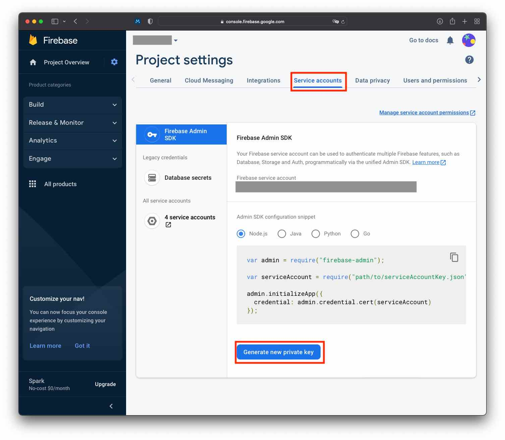

# 如何在 vocechat 中配置推送（Push Notification) 服务?

管理员需在 Firebase Cloud Console 中配置 **FCM**。

⚠️ 请注意：如果使用自定义的推送配置，则移动端（iOS 及 Android）的推送服务将会不可用，只有网页端可以收到推送消息。目前在最新的网页端中提供了一套默认配置，详情可以访问设置 -> Firebase。

⚠️ 如果您的 VoceChat 后端部署在中国大陆，则推送可能因网络管制而不可用，因为目前的推送服务依赖 Google Firebase。我们有计划逐步将推送替换成直接与 APNs 及其他国内安卓手机厂商支持的平台。

## Firebase 设置

管理员需要首先创建 Firebase 项目，并已经将相应服务代码添加至项目中。如果已经完成上述步骤，则可跳过此段；如果没有，请参阅 [FCM](https://firebase.google.com/docs/cloud-messaging)。

1.  从 Firebase 控制台获取配置文件
    访问 [Firebase Console](https://console.firebase.google.com)。点击左侧边栏偏上的齿轮图标进入 **Project Settings**
    

2.  随后在页面上方的横向选项卡中，选择 **Service accounts**。
    下拉页面至最下，点击 **Generate new private key**，并将下载的 json 文件保存妥当。
    

3.  将有关配置项复制至 vocechat 设置
    进入 **vocechat Settings** 页面，在 **Configuration** 中选择 **Firebase**。

    此页面可以填写四个配置项，分别为 Token Url, Project Id, Private Key 和 Client Email。 您可以在上述第一步下载的 .json 文件中找到相应的字段，复制并粘贴后，保存即可。
    
