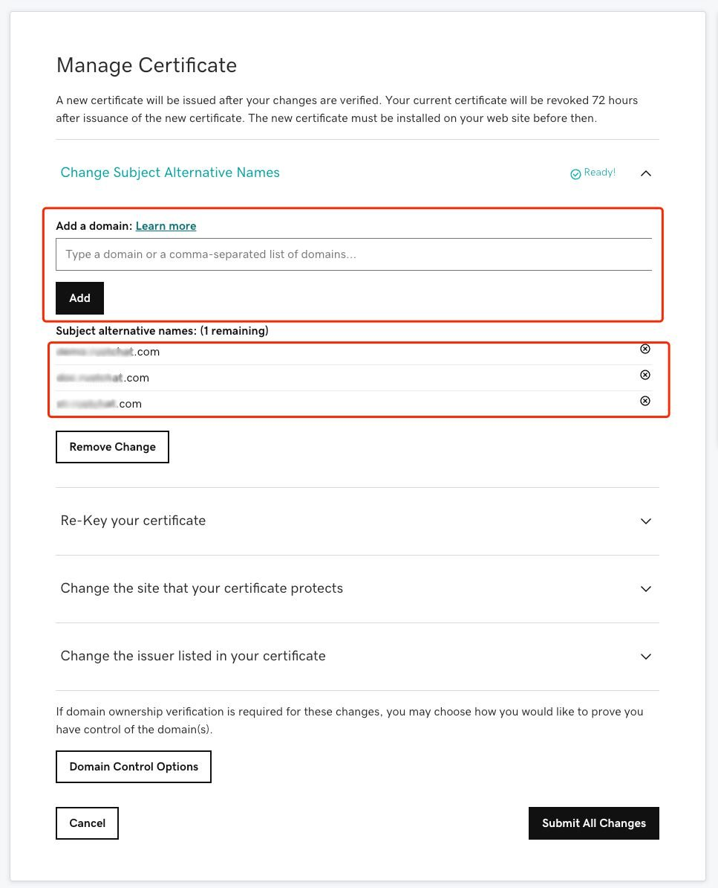
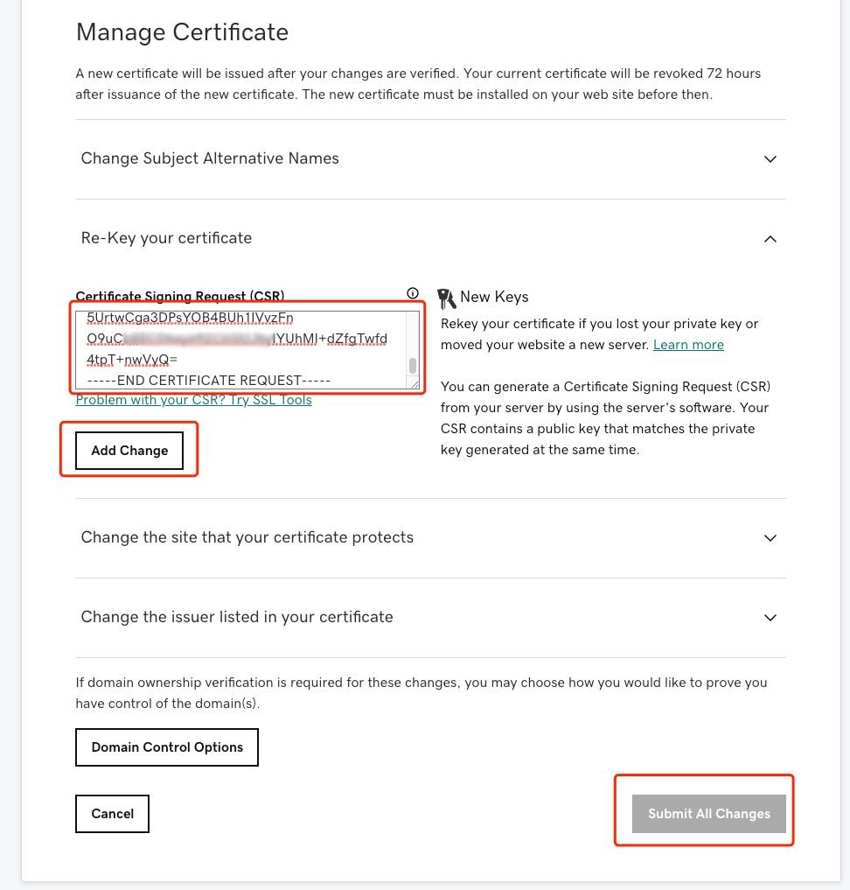

# How to get certificates in GoDaddy?
###GoDaddy购买并配置SSL证书常在英文环境中进行，暂未进行中文翻译。

Prepositional knowledges:

- .key: PKCS8 format private key file (Base64 encoding)
- .csr: partial information of PKCS10 format certificate (including public key, organization name etc. , the public key is generated by .key)
- .crt: Certificate file, which added CA sign based on .csr(Godaddy will generate it after user upload .csr file)
- .der: Binary format, which can be converted to and from pem format, convert command: `openssl x509 -inform der -in xxx.der -out xxx.pem`
- .pem: base64 format file, Determine the specific content according to the beginning and end character identification, It may be private key, public key, certificate or any other data.
- .p12, .pkcs12, .pfx: PKCS12 format, merged by private key, public key, certificate etc.

### 1. generate private key in local computer & CSR & Certificate:

```shell
# generate private key
openssl genpkey -algorithm RSA \
    -pkeyopt rsa_keygen_bits:4096 \
    -pkeyopt rsa_keygen_pubexp:65537 | \
    openssl pkcs8 -topk8 -nocrypt -outform pem > voce.chat.key

# generate CSR file
openssl req -subj "/C=US/ST=Arizona/L=Scottsdale/O=Privoce,Inc./CN=*.voce.chat/emailAddress=api.privoce@gmail.com" \
    -new -days 3650 -key voce.chat.key -out voce.chat.csr

# generate self-sign file
openssl x509 -signkey voce.chat.key -in voce.chat.csr -req -days 365 -out voce.chat.crt

# view certificate
openssl req -text -noout -verify -in voce.chat.csr
```

will get following files, important! backup well:

```shell
-rw-r--r--  1 user  staff   1.9K May  5 00:34 voce.chat.crt
-rw-r--r--  1 user  staff   1.7K May  5 00:34 voce.chat.csr
-rw-r--r--  1 user  staff   3.2K May  5 00:29 voce.chat.key
```

Adopted .key .csr we can already configure nginx similar systems, only the browser will prompt the risk.

### 2. To apply for a GoDaddy account and purchase a domain name certificate, you need to go through the payment process and follow the prompts.

Godaddy website: [https://www.godaddy.com/](https://www.godaddy.com/)

### 3. Set domain & CSR:




### 4. Download certificate

  
You will get a compressed file xxx Zip. After extracting, the following files are obtained:

```shell
-rw-rw-r--@ 1 user  staff   2.4K May  4 07:47 1aeb156731cb52d3.crt
-rw-rw-r--@ 1 user  staff   2.4K May  4 07:47 1aeb156731cb52d3.pem
-rw-rw-r--@ 1 user  staff   4.7K May  4 07:47 gd_bundle-g2-g1.crt
```

### 5. Merge the certificates and overwrite our self signed certificates (we have better certificates).

```shell
cat 1aeb156731cb52d3.crt gd_bundle-g2-g1.crt > voce.chat.crt
```

### 6. vocechat-server configuration

Copy certificate file:

```shell
cp voce.chat.crt cert/ca.crt
cp voce.chat.key cert/ca.key
```

modify config/config.toml

```shell

[network]
bind = "0.0.0.0:3000"
domain = "domain.com"

# [network.tls]
# type = "self_signed"

[network.tls]
type = "certificate"
# cert = "/path/voce.chat.crt"
# key = "...."
path = "./cert"
```

restart vocechat-server:

```shell
/etc/init.d/vocechat-server restart
```

<!--
```shell
server {
    listen 443;
    server_name www.xxx.com;
    ssl	on;
    ssl_certificate /usr/local/ssl/domain.crt;
    ssl_certificate_key /usr/local/ssl/domain.key;
}
```
-->
